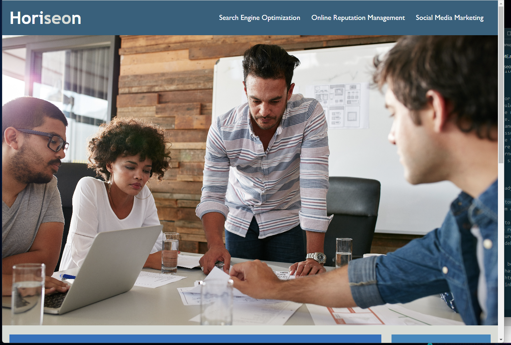
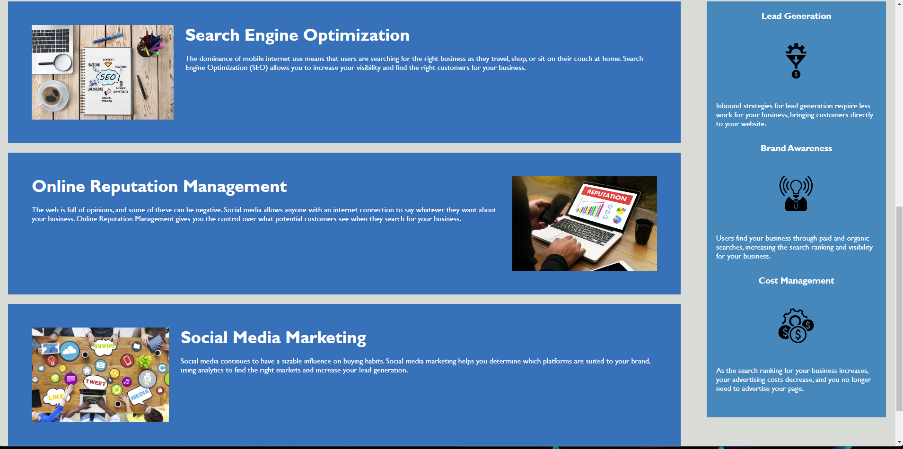
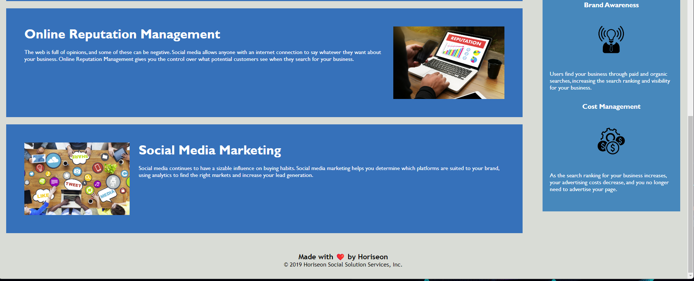

# <Horiseon website>

## Discription

The motivation for this was to help the customer to have a better website. That would work up to there standers. Also make them happy with my work. The reason for this product was to debug a few issues with the web page. Clean up the code so that it is easier to work with and understand where everything is in sequential order. This solved the bug issue with the nav bar. The cleaning up so the html and css will make the next web delvoper have a easier time with hdml and ccs.There were alot of redundancy in the files that could get confusing. I learned that cleaning up the code make the buliding or updateing of the site quicker and easier.

## Installation
 This was a already bulit web page. Had to clone the web page to work on it.
 -Make a repoisitory
 -copy files from already built web page put in same name as repository
 -push the file to the repoisitory
 -commit file to repoisitory
-check to make sure they are linked together
-Then start the debugging of web page 

## usage
The web page has been made more user frindly to work with and work on. The nav bar has been re-coded to go to the link that you click on in nav bar. The html has been cleaned up so you can easily understand how the css is linked to html. Gave the code a sequential order.

## credits

-My class mates in the bootcamp
-The TA's in the bootcamp for helping me understand better and teacher for anwsering my questions
-https://www.w3schools.com/ 
-https://coding-boot-camp.github.io/full-stack/github/professional-readme-guide
-https://www.youtube.com/watch?v=OEV8gMkCHXQ
-https://www.youtube.com/watch?v=LGQuIIv2RVA&t=38s
-bootcampspot

